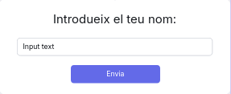
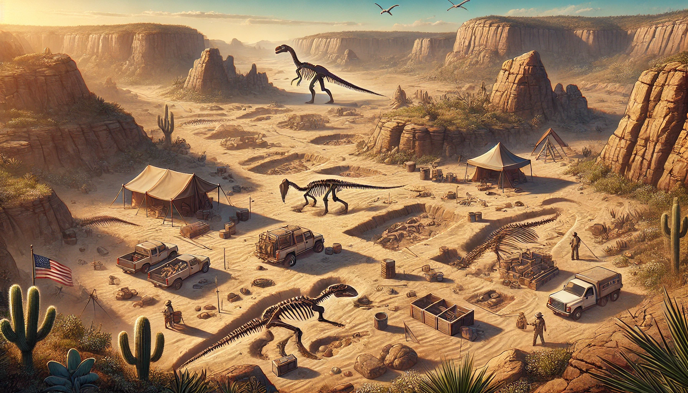

# 🦴 Excavació Juràssica

**Benvingut a Excavació Juràssica**, un emocionant joc d'estratègia on hauràs de trobar i desenterrar tots els ossos ocults sota els sediments mil·lenaris. Converteix-te en el millor **paleontòleg** 🦕 i fes història!

## 🖼️ Wireframes

El joc es divideix en **3 pàgines principals**, cadascuna amb un paper fonamental per guiar-te en aquesta aventura paleontològica:

### 1. Pàgina d'inici
La primera parada en aquesta aventura! A la **Pàgina d'inici**, podràs:
- 📜 Llegir una breu descripció sobre el joc.
- Accedir al **Rànquing de Paleontòlegs** 🏆 per veure qui són els més prestigiosos.
- Iniciar una nova excavació fent clic al botó de **"Començar Joc"** 🕹️.

  

### 2. Pàgina de Joc
Aquí és on comença la veritable acció! En la **Pàgina de Joc** podràs:
- Endinsar-te en l'experiència completa d'**Excavació Juràssica**, interactuant amb el tauler 🦴.
- Veure com la teva **fama paleontològica** 🏅 augmenta amb cada troballa i excavació que realitzes.
- Controlar el **temps d'excavació** ⏳, que es comptabilitza a mesura que progresses.
- Observar el resultat de la teva **última excavació**: què has trobat o si has de seguir excavant.
- Consultar quins **ossos segueixen ocults** sota terra i planificar la teva pròxima jugada.
- Seguir una **descripció detallada** 🧐 que et guiarà per obtenir el màxim de **fama** i optimitzar les teves accions.

  

Una vegada hagis guanyat, apareixerà una finestra on hauràs d'introduir el teu nom per guardar-lo i així poder aparèixer al **Rànquing de Paleontòlegs**. A més, en pantalla, a la part inferior dreta, apareixerà un botó que et permetrà dirigir-te al rànquing directament des de la pàgina de joc.

  

### 3. Rànquing de Paleontòlegs
Aquesta és la pàgina dels campions! En el **Rànquing de Paleontòlegs** podràs:
- Veure el **rànquing** amb els paleontòlegs més famosos 🥇 i amb més fama acumulada.
- Comprovar si el teu nom ha arribat a les primeres posicions! 🦕🎉

  

---

### 🌐 Diagrama General del Wireframe

A continuació, es mostra un **diagrama general** del wireframe del joc, incloent les relacions entre les diferents pàgines i els botons:

  

---
## 🎨 Look and Feel

El disseny d'**Excavació Juràssica** segueix una estètica **rústica i terrosa**, evocant l'ambient d'una excavació paleontològica. El joc busca transportar el jugador a un entorn on la terra, les roques i els fòssils són protagonistes. A continuació, es detallen els elements clau del disseny visual i l'experiència d'usuari:

### 🌈 Paleta de Colors

La paleta de colors se centra en tonalitats càlides i terroses, per reflectir l'entorn d'una excavació arqueològica:

- **Color de fons**: #ede0d4 - Un to suau que emula la pols i la terra.
- **Color dels títols**: #ede0d4 - Utilitza el mateix to que el fons, donant una sensació d'integració amb la terra.
- **Divs primaris**: #C39570 - Tons de marró per a les àrees informatives principals.
- **Divs secundaris**: #f5ddbd - Una variació més clara per donar profunditat als contenidors informatius.
- **Tauler - Files de capçalera**: #E1BB95 - Un marró suau que serveix com a base per a les celdes.
- **Celdes del tauler tapades**: #9c6644 - Celdes sense descobrir, similars a la terra seca.
- **Celdes destapades sense res**: #864D31 - Celdes buides després de l'excavació, que recorden la terra remoguda.
- **Celdes destapades amb ossos**: #fffffd - Un color clar per ressaltar la troballa de fòssils.
- **Bordes del tauler**: #4a160d - Un color fosc que defineix els límits de les celdes excavades.
- **Botons**: #703722 - Els botons són transparents, però el text i els bordes utilitzen aquest marró profund. Al fer hover, el fons es torna d'aquest color amb text en blanc.
- **Cinta del títol**: #513f36 - Un marró grisenc utilitzat com a fons per al títol, semblant a la cinta de paper.
- **Color del text**: #232323 - Un gris fosc que assegura la llegibilitat.

### ✒️ Tipografia

L'elecció de les tipografies s'ha fet per reforçar l'estètica de **paleontologia** i aventura. Cada tipus de text té el seu propi estil per transmetre la seva importància i funció dins del joc:

- **Títol Principal**: Utilitza la font **Inknut Antiqua**, que és un estil més **elegant i clàssic**. Aquesta font es fa servir per als títols principals, donant una sensació d'importància i història.

- **Títols Secundaris**: Es fa servir la font **Akaya Kanadaka**, que té un toc més **desenfadat i manuscrit**. S'assembla a l'escriptura a mà, destacant aquells títols amb menys rellevància però mantenint l'ambient rústic.

- **Text Pla**: Per al cos del text, s'utilitza la font **Inter**, que és una font **neta, plana i senzilla**, assegurant una llegibilitat clara i diferenciant el text pla del contingut més decoratiu o destacat.

### 🔘 Botons i Interactivitat

Els botons juguen un paper crucial en la navegació i l'experiència d'usuari:

- **Estil General dels Botons**: Els botons tenen un disseny transparent amb un **borde i text del color #703722**. Al passar el cursor per sobre (**hover**), el fons del botó es torna del mateix color i el text es fa de color blanc, creant una **transició suau de 0.5 segons** que dona una sensació de fluïdesa.

- **Botons de la Pàgina d'Inici**: Els botons a la pàgina d'inici són **més grans** i amb una **tipografia de major mida**, convidant l'usuari a començar el joc o a accedir al rànquing. Inclouen icones SVG, com un **control de joc** per a l'inici de la partida o un **podi** per accedir al rànquing.

- **Botons de Navegació**: A les altres pàgines, els botons que permeten la navegació són **més petits**, però mantenen el mateix estil visual. Alguns d'aquests botons tenen icones de **fletxes**, indicant que l'usuari pot avançar o retrocedir en la seva experiència.

### 🏞️ Imatges i Fons

Per completar l'estètica rústica, es fa servir una única **imatge de fons** en la **pàgina d'inici**, que evoca l'ambient d'una excavació enmig de la natura, amb terra, roques i fòssils. Aquesta imatge immersiva ajuda a que el jugador se submergeixi en el paper de paleontòleg.

A més, es fan servir **icones SVG** de **[Font Awesome](https://fontawesome.com)** per millorar la interactivitat i fer que la navegació per la web sigui més intuïtiva. Aquests icones proporcionen pistes visuals que guien l'usuari a través de les diferents opcions disponibles.

#### 🌅 Imatge de Fons
 <!-- Assegura't d'afegir l'enllaç correcte a la imatge de fons -->

#### 🌟 Icones Utilitzats
Els següents icones **SVG** de **[Font Awesome](https://fontawesome.com)** es fan servir per millorar la interactivitat dels botons i proporcionar una millor experiència d'usuari:

- **Botó de Començar Joc**: `<i class="fa-solid fa-gamepad"></i>` 
- **Botó de Rànquing**: `<i class="fa-solid fa-ranking-star"></i>`
- **Botó de Tornar**: `<i class="fa-solid fa-chevron-left"></i>`
- **Botó d'Avançar**: `<i class="fa-solid fa-chevron-right"></i>`

A més, s'utilitza un **SVG** amb forma de **dinosaure** 🦖 per decorar els títols de les pàgines de **Rànquing** i **Joc**, aportant un toc temàtic que reforça l'ambient d'excavació i paleontologia del joc.

### 🌿 Estètica General

L'estètica general de **Excavació Juràssica** busca crear una atmosfera de descoberta i aventura. Amb els seus colors terrosos, tipografies evocadores i disseny minimalista però detallat, el joc transporta l'usuari a un entorn paleontològic. Cada element visual, des dels **botons** fins a les **celdes del tauler**, està pensat per reforçar aquest ambient.

L'objectiu és fer que el jugador se senti com un paleontòleg en una excavació, buscant fòssils entre la terra, mentre gestiona el temps i la fama que guanya en el procés.
