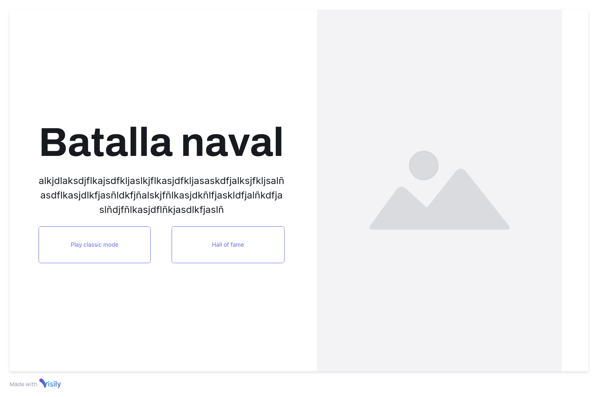
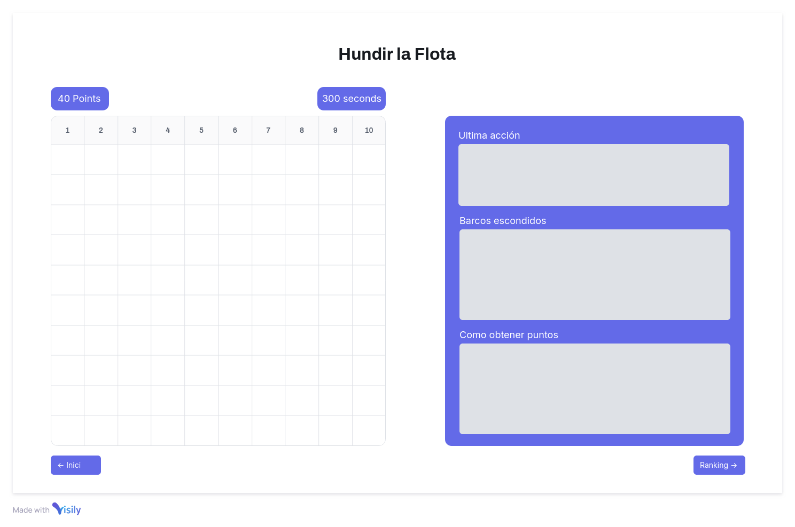

# 🦴 Excavació Juràssica

**Benvingut a Excavació Juràssica**, un emocionant joc d'estratègia on hauràs de trobar i desenterrar tots els ossos ocults sota els sediments mil·lenaris. Converteix-te en el millor arqueòleg i fes història!

## 🖼️ Wireframes

El joc es divideix en **3 pàgines principals**, cadascuna amb un paper fonamental per guiar-te en aquesta aventura arqueològica:

### 1. Pàgina d'inici
La primera parada en aquesta aventura! A la **Pàgina d'inici**, podràs:
- Llegir una breu descripció sobre el joc.
- Accedir al **Rànquing d'Arqueòlegs** per veure qui són els més prestigiosos.
- Iniciar una nova excavació fent clic al botó de **"Començar Joc"**.

 <!-- Aquí pots afegir l'enllaç a la imatge -->

### 2. Pàgina de Joc
Aquí és on comença la veritable acció! En la **Pàgina de Joc** podràs:
- Endinsar-te en l'experiència completa d'**Excavació Juràssica**, interactuant amb el tauler.
- Veure com la teva **fama arqueològica** augmenta amb cada troballa i excavació que realitzes.
- Controlar el **temps d'excavació**, que es comptabilitza a mesura que progresses.
- Observar el resultat de la teva **última excavació**: què has trobat o si has de seguir excavant.
- Consultar quins **ossos segueixen ocults** sota terra i planificar la teva pròxima jugada.
- Seguir una **descripció detallada** que et guiarà per obtenir el màxim de **fama** i optimitzar les teves accions.

### 3. Rànquing d'Arqueòlegs
Aquesta és la pàgina dels campions! En el **Rànquing d'Arqueòlegs** podràs:
- Veure el **rànquing** amb els arqueòlegs més famosos i amb més fama acumulada.
- Comprovar si el teu nom ha arribat a la llista dels **Millors Arqueòlegs del Món**!

---

## 🌐 Diagrama General del Wireframe

A continuació, es mostra un **diagrama general** del wireframe del joc, incloent les relacions entre les diferents pàgines i els botons:

 <!-- Aquí afegeix l'enllaç de la imatge del wireframe -->
