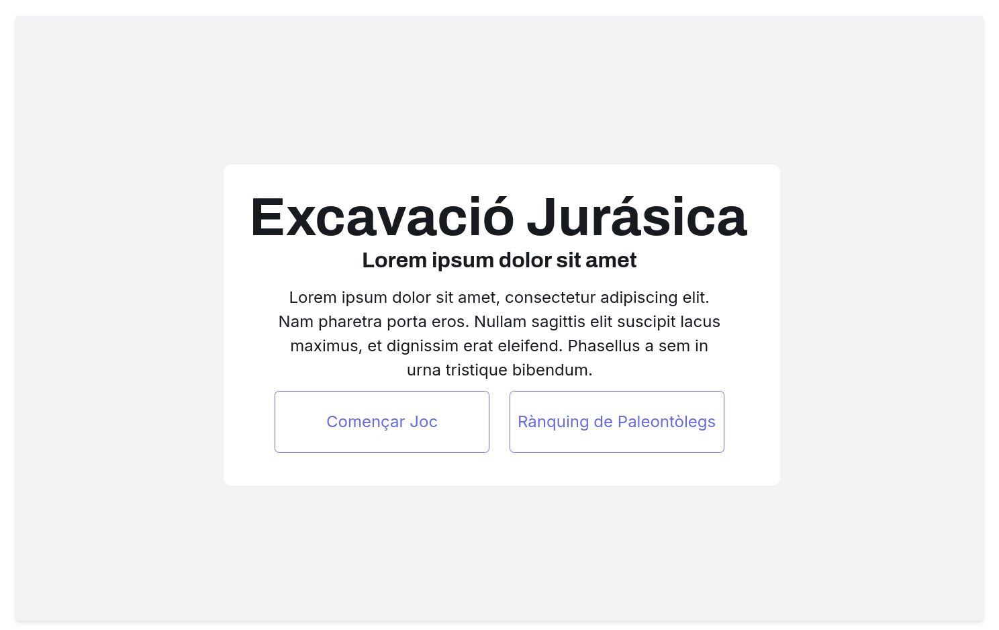
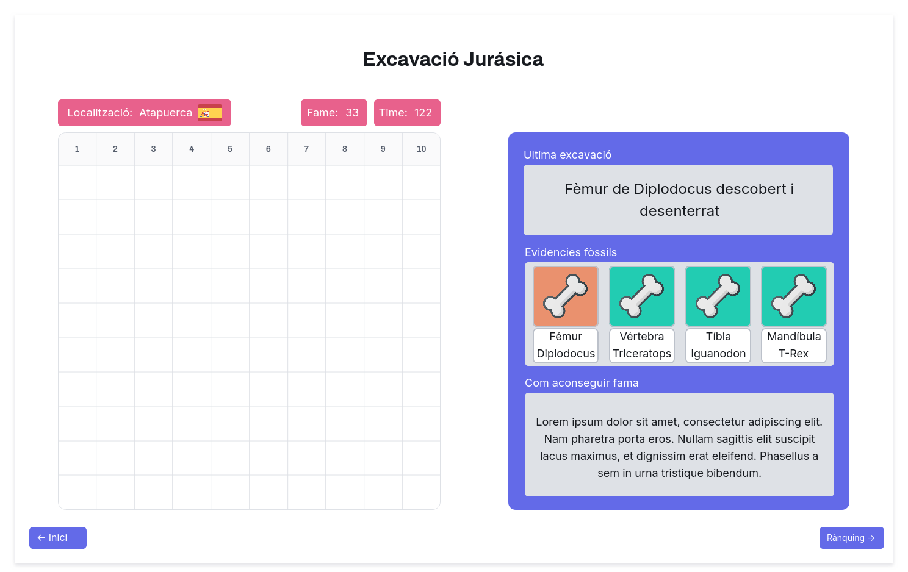

# 🦴 Excavació Juràssica

**Benvingut a Excavació Juràssica**, un emocionant joc d'estratègia on hauràs de trobar i desenterrar tots els ossos ocults sota els sediments mil·lenaris. Converteix-te en el millor **paleontòleg** 🦕 i fes història!

## 🖼️ Wireframes

El joc es divideix en **3 pàgines principals**, cadascuna amb un paper fonamental per guiar-te en aquesta aventura paleontològica:

### 1. Pàgina d'inici
La primera parada en aquesta aventura! A la **Pàgina d'inici**, podràs:
- 📜 Llegir una breu descripció sobre el joc.
- Accedir al **Rànquing de Paleontòlegs** 🏆 per veure qui són els més prestigiosos.
- Iniciar una nova excavació fent clic al botó de **"Començar Joc"** 🕹️.

  

### 2. Pàgina de Joc
Aquí és on comença la veritable acció! En la **Pàgina de Joc** podràs:
- Endinsar-te en l'experiència completa d'**Excavació Juràssica**, interactuant amb el tauler 🦴.
- Veure com la teva **fama paleontològica** 🏅 augmenta amb cada troballa i excavació que realitzes.
- Controlar el **temps d'excavació** ⏳, que es comptabilitza a mesura que progresses.
- Observar el resultat de la teva **última excavació**: què has trobat o si has de seguir excavant.
- Consultar quins **ossos segueixen ocults** sota terra i planificar la teva pròxima jugada.
- Seguir una **descripció detallada** 🧐 que et guiarà per obtenir el màxim de **fama** i optimitzar les teves accions.

  

### 3. Rànquing de Paleontòlegs
Aquesta és la pàgina dels campions! En el **Rànquing de Paleontòlegs** podràs:
- Veure el **rànquing** amb els paleontòlegs més famosos 🥇 i amb més fama acumulada.
- Comprovar si el teu nom ha arribat a les primeres posicions! 🦕🎉

  

---

### 🌐 Diagrama General del Wireframe

A continuació, es mostra un **diagrama general** del wireframe del joc, incloent les relacions entre les diferents pàgines i els botons:

  

